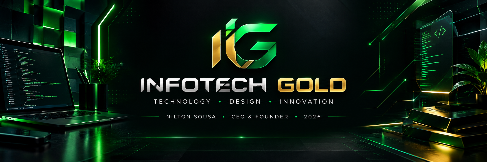

<div align="center">



<br><br>


<br>


</div>

---

# 🟢 `> whoami`

```bash
┌──[infotechgold@github]─[~/company]
└─$ whoami

INFO TECH GOLD
```

### 🚀 Tecnologia. Design. Desenvolvimento. Inovação.

A **InfoTech GOLD** é uma empresa de tecnologia criada em **2026**, localizada em **Limoeiro, Pernambuco — Brasil**, atualmente em processo de desenvolvimento e expansão.

Nossa proposta é unir **desenvolvimento de software, design digital, desenvolvimento web e inteligência artificial** para transformar ideias em produtos e experiências digitais.

```text
                    ┌─────────────────────┐
                    │    INFOTECH GOLD    │
                    │                     │
                    │  TECHNOLOGY + DESIGN│
                    │        + AI         │
                    └──────────┬──────────┘
                               │
             ┌─────────────────┼─────────────────┐
             │                 │                 │
             ▼                 ▼                 ▼
          DESIGN         DEVELOPMENT            AI
             │                 │                 │
             └─────────────────┼─────────────────┘
                               ▼
                     DIGITAL SOLUTIONS
```

---

# 👨‍💻 `> founder`

<div align="center">

## NILTON SOUSA

### CEO • Founder • Developer

🇧🇷 Limoeiro — Pernambuco — Brasil

</div>

Sou **Nilton Sousa**, fundador e CEO da **InfoTech GOLD**.

Minha visão é construir uma empresa de tecnologia capaz de transformar ideias em soluções digitais através da combinação de:

```text
💻 PROGRAMMING
🎨 DESIGN
🌐 WEB
⚙️ SOFTWARE
🤖 ARTIFICIAL INTELLIGENCE
🚀 INNOVATION
```

A InfoTech GOLD está em construção.

E esse é apenas o começo.

---

# ⚡ `> services`

<div align="center">

|      🎨 DESIGN     |   🌐 WEB   |  ⚙️ SOFTWARE |
| :----------------: | :--------: | :----------: |
|    Landing Pages   |  Web Sites | Sistemas Web |
|   UI / Interfaces  | E-commerce |   Softwares  |
| Identidade Digital |  WordPress |  Dashboards  |

</div>

### 🎯 Landing Pages

Interfaces desenvolvidas para apresentar produtos, serviços, profissionais e empresas de maneira moderna e estratégica.

### 🌐 Web Sites

Sites institucionais, páginas profissionais e experiências digitais responsivas.

### 🛒 Lojas Virtuais

Estruturas digitais para apresentação e comercialização de produtos.

### ⚙️ Sistemas Web

Sistemas personalizados para organização, gerenciamento e automação de processos.

### 💻 Softwares

Soluções desenvolvidas de acordo com necessidades específicas.

### 🤖 Inteligência Artificial

Utilização de ferramentas de IA para potencializar criatividade, desenvolvimento, pesquisa e produtividade.

---

# 🧠 `> technology_stack`

<div align="center">

### FRONT-END


<br><br>

### BACK-END


<br><br>

### DATABASE


<br><br>

### CMS


<br><br>

### DESIGN


<br><br>

### ARTIFICIAL INTELLIGENCE


</div>

---

# 🧩 `> architecture`

```text
INFO TECH GOLD
│
├── 🎨 DESIGN
│   ├── UI
│   ├── Visual Identity
│   ├── Landing Pages
│   └── Digital Content
│
├── 🌐 WEB
│   ├── HTML
│   ├── CSS
│   ├── Bootstrap
│   ├── JavaScript
│   └── WordPress
│
├── ⚙️ BACK-END
│   ├── PHP
│   └── Laravel
│
├── 🗄️ DATABASE
│   └── PostgreSQL
│
└── 🤖 AI
    ├── ChatGPT
    └── Gemini
```

---

# 💚 `> philosophy`

> **"Grandes soluções começam com grandes ideias."**

Não acreditamos que tecnologia seja apenas código.

Tecnologia é a combinação entre:

```text
PROBLEMA
   ↓
IDEIA
   ↓
ESTRATÉGIA
   ↓
DESIGN
   ↓
CÓDIGO
   ↓
SOLUÇÃO
   ↓
EVOLUÇÃO
```

Nosso objetivo é construir experiências digitais que sejam:

**Modernas • Funcionais • Responsivas • Escaláveis • Inteligentes**

---

# 🔥 `> development`

<div align="center">

```text
╔══════════════════════════════════════════╗
║           BUILDING THE FUTURE            ║
╠══════════════════════════════════════════╣
║                                          ║
║   [████████████████████░░░░░░]  2026     ║
║                                          ║
║   STATUS: DEVELOPING                     ║
║   MISSION: BUILD                         ║
║   VISION: EXPAND                         ║
║                                          ║
╚══════════════════════════════════════════╝
```

### 🚧 INFO TECH GOLD IS BUILDING

</div>

A empresa foi criada em **2026** e encontra-se em fase de desenvolvimento.

Estamos construindo nossa identidade, nossos produtos, nossos sistemas e nossa presença digital passo a passo.

---

# 🚀 `> roadmap`

```text
2026
│
├── 🟢 Fundação da InfoTech GOLD
├── 🟢 Construção da identidade
├── 🟢 Desenvolvimento Web
├── 🟢 Landing Pages
├── 🟢 Sistemas
├── 🟢 E-commerce
└── 🟢 Exploração de Inteligência Artificial
        │
        ▼
      FUTURO
        │
        ├── 🔵 Produtos próprios
        ├── 🔵 Sistemas SaaS
        ├── 🔵 Automação
        ├── 🔵 Aplicações avançadas
        ├── 🔵 Novas tecnologias
        └── 🔵 Expansão
```

---

# 💻 `> code`

```php
<?php

class InfoTechGold
{
    public string $company = "InfoTech GOLD";
    public string $founder = "Nilton Sousa";
    public int $founded = 2026;
    public string $location = "Limoeiro, Pernambuco, Brasil";

    public array $services = [
        "Landing Pages",
        "Web Sites",
        "E-commerce",
        "Sistemas Web",
        "Softwares",
        "Design",
        "AI"
    ];

    public function mission(): string
    {
        return "Transformar ideias em soluções digitais.";
    }
}
```

---

# 🌐 `> digital_presence`

<div align="center">

### 🚀 CONECTE-SE COM A INFOTECH GOLD

<br>

[](https://github.com/)

[](#)

[](#)

</div>

---

# 📊 `> github_statistics`

<div align="center">


<br><br>


</div>

---

# 🐍 `> contribution_matrix`

<div align="center">


</div>

---

# 📈 `> currently_building`

```text
┌───────────────────────────────────────────────┐
│                                               │
│  🟢 WEB DEVELOPMENT                           │
│  🟢 DIGITAL DESIGN                            │
│  🟢 LANDING PAGES                             │
│  🟢 WEB SYSTEMS                               │
│  🟢 E-COMMERCE                                │
│  🟢 SOFTWARE                                  │
│  🟢 ARTIFICIAL INTELLIGENCE                   │
│                                               │
└───────────────────────────────────────────────┘
```

---

# 💡 `> vision`

<div align="center">

## NÃO ESTAMOS APENAS ESCREVENDO CÓDIGO.

### ESTAMOS CONSTRUINDO UMA MARCA.

<br>

### NÃO ESTAMOS APENAS CRIANDO SITES.

### ESTAMOS CRIANDO EXPERIÊNCIAS.

<br>

### NÃO ESTAMOS APENAS USANDO TECNOLOGIA.

### ESTAMOS EXPLORANDO O QUE ELA PODE SE TORNAR.

</div>

---

# 🌎 `> from Pernambuco to the world`

<div align="center">

### 📍 LIMOEIRO — PERNAMBUCO — BRASIL 🇧🇷

<br>

**Uma empresa que começa localmente,
mas pensa globalmente.**

<br>

```text
LOCAL ROOTS
     ↓
DIGITAL VISION
     ↓
TECHNOLOGY
     ↓
INNOVATION
     ↓
GLOBAL FUTURE
```

</div>

---

# 🏆 `> milestones`

|     Ano    | Marco                                    |
| :--------: | :--------------------------------------- |
|  **2026**  | 🟢 Fundação da InfoTech GOLD             |
|  **2026**  | 🟢 Construção da identidade tecnológica  |
|  **2026**  | 🟢 Desenvolvimento de soluções Web       |
|  **2026+** | 🔵 Expansão dos produtos e serviços      |
| **Future** | 🟣 Novas tecnologias e produtos próprios |

---

<div align="center">

# ⚡ BUILD

# 🎨 DESIGN

# 💻 CODE

# 🤖 INNOVATE

# 🚀 EVOLVE

<br>


### © 2026 InfoTech GOLD

**Technology • Design • Innovation**

<br>

<sub>

Built with 💚 by **Nilton Sousa**

</sub>

</div>
